# System Metrics Mobile App

Monitor your mobile health. Using this mobile app, you can see thermal information, battery level,
memory usages and other details of your mobile

## Tools and technologies:

1. Framework: flutter-3.38.7
2. Programming language: dart-3.10.7

## Packages:

- state management:
    - flutter_bloc: ^9.1.1
    - bloc_concurrency: ^0.3.0
- state object's equality check:
    - equatable: ^2.0.8
- network call:
    - dio: ^5.9.1
- dependency injection:
    - get_it: ^9.2.0
- screen navigation:
  - go_router: ^17.0.1
- date format:
  - intl: ^0.20.2
- testing:
    - test:
    - mocktail: ^1.0.4

## Installation:

To setup flutter:<br>
Follow the [official guide](https://docs.flutter.dev/get-started/install)

To run this project locally, follow these steps:

1. **Clone the repository**:

  ```bash
  git clone https://github.com/Neloy-SWE/660778ee0cf2.git
  ```

2. **Navigate to the project directory(root folder)**:

  ```bash
  cd 660778ee0cf2/mobile_app/system_metrics_mobile_app
```

3. **Install dependencies**:

  ```bash
  flutter pub get
```

4. **Run test**:

  ```bash
  flutter test
```

5. **Run the application**:

  ```bash
  flutter run
```

## Project Structure:

```bash
├── Dependency
│   └── service_injection.dart
├── core
│   ├── app_asset.dart
│   ├── app_color.dart
│   ├── app_constant.dart
│   ├── app_size.dart
│   ├── app_text.dart
│   └── app_theme.dart
├── data
│   ├── api
│   │   ├── api_call_get_vitals.dart
│   │   ├── api_call_get_vitals_analytics.dart
│   │   ├── api_call_post_vitals.dart
│   │   └── api_path.dart
│   ├── client
│   │   ├── client.dart
│   │   ├── client_constant.dart
│   │   └── client_interceptor.dart
│   ├── model
│   │   ├── model_analytics.dart
│   │   ├── model_history_list.dart
│   │   └── model_system_metrics.dart
│   └── repository
│       ├── repository_get_vitals.dart
│       ├── repository_get_vitals_analytics.dart
│       └── repository_post_vitals.dart
├── main.dart
├── presentation
│   ├── custom_widget
│   │   ├── custom_button.dart
│   │   ├── custom_date_picker.dart
│   │   ├── custom_failed_widget.dart
│   │   ├── custom_snack_bar.dart
│   │   └── loader
│   │       ├── custom_loader_analytics.dart
│   │       ├── custom_loader_dashboard.dart
│   │       ├── custom_loader_history.dart
│   │       └── custom_loader_simple_dialogue.dart
│   └── screen
│       ├── dashboard
│       │   ├── bloc
│       │   │   ├── bloc_dashboard.dart
│       │   │   ├── event_dashboard.dart
│       │   │   └── state_dashboard.dart
│       │   └── screen_dashboard.dart
│       ├── history
│       │   ├── bloc
│       │   │   ├── analytics
│       │   │   │   ├── bloc_analytics.dart
│       │   │   │   ├── event_analytics.dart
│       │   │   │   └── state_analytics.dart
│       │   │   └── history_list
│       │   │       ├── bloc_history_list.dart
│       │   │       ├── event_history_list.dart
│       │   │       └── state_history_list.dart
│       │   └── screen_history.dart
│       └── splash
│           └── screen_splash.dart
├── router
│   └── app_router.dart
└── tool
    └── tool_grid_fixed_height_delegate.dart
```

### test:
```bash
└── test_repository
    ├── repository_get_vitals_analytics_test.dart
    ├── repository_get_vitals_test.dart
    └── repository_post_vitals_test.dart
```

## Overview

<p float="left">
  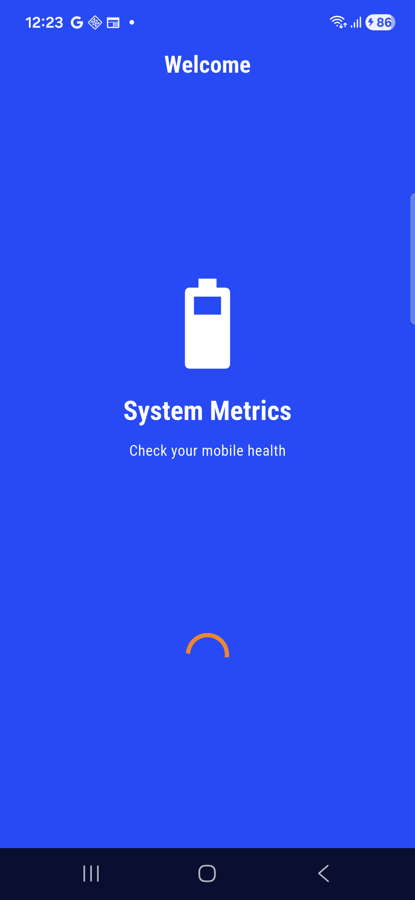

- splash screen.

<br>
<p float="left">
  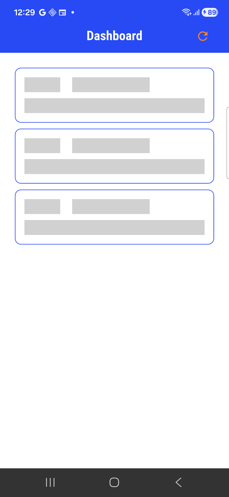
  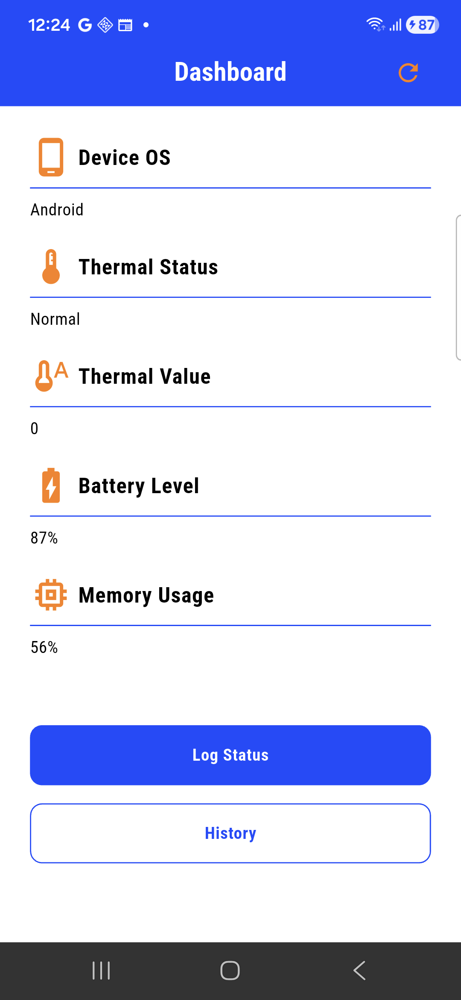
  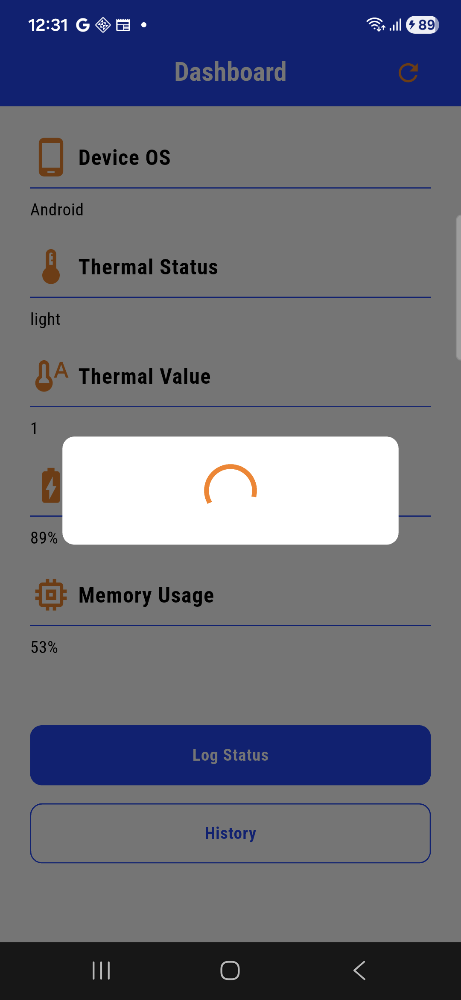
  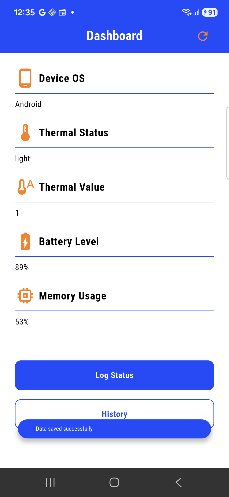

- using method channel, app will retrieve thermal, battery, OS, memory related details from android/ios end.
- refresh using both pull and action button.
- log save.

<br>
<p float="left">
  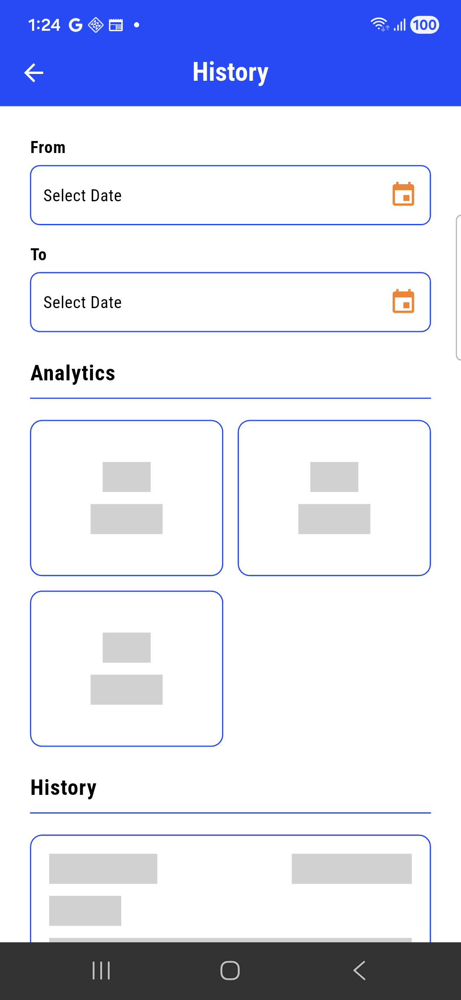
  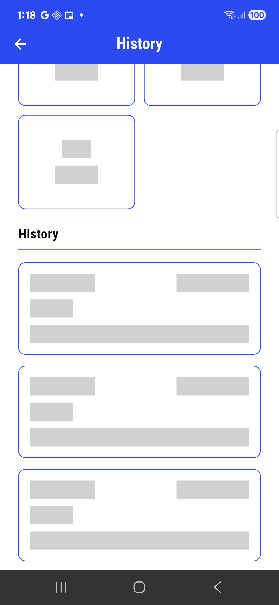
  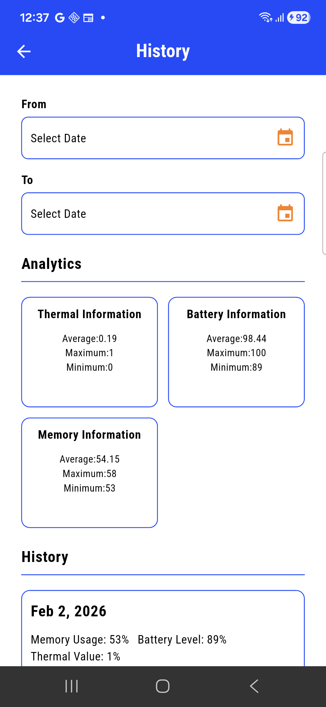
  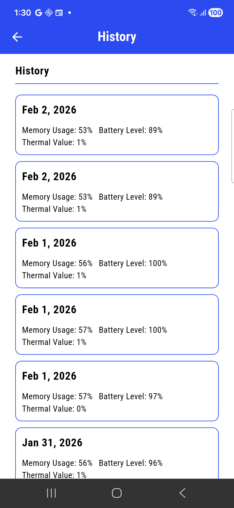

- user can see analytics data.
- user can also filter analytics data using date range while selecting from or to or both.
- log history list with lazy loading.

<br>
<p float="left">
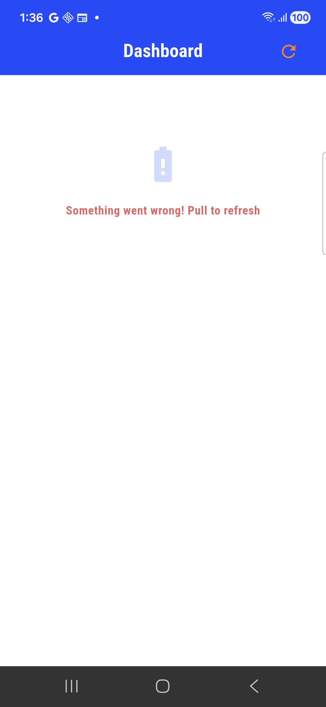
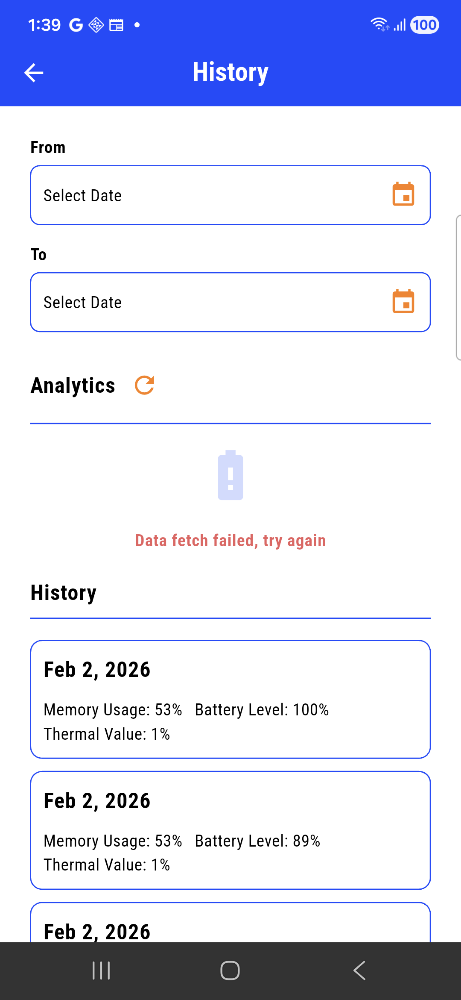


- error pages for dashboard, analytics and history.
- separate reloading for analytics and history.

## Future scopes:
- offline first approach
- history search option
- alert via push notification

### Contact:

For further implementation feel free to reach out at: taufiqneloy.swe@gmail.com